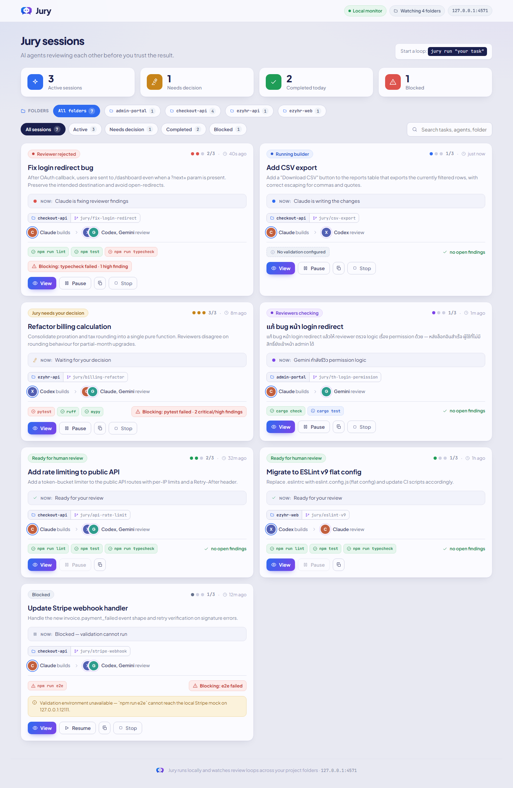
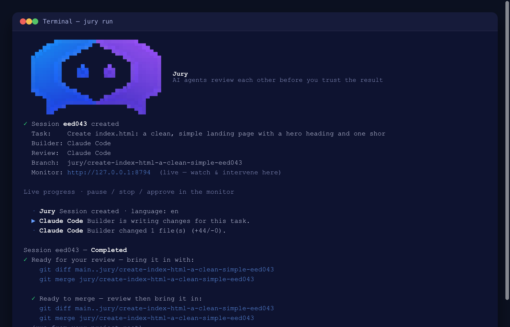
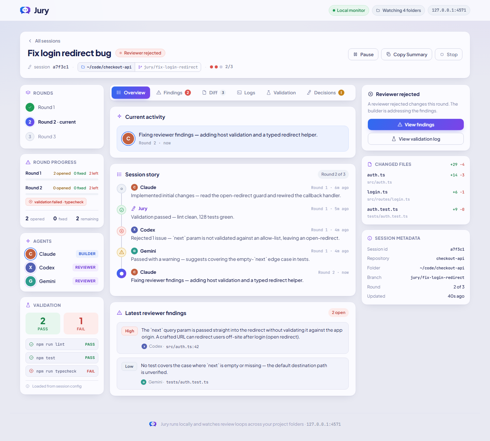
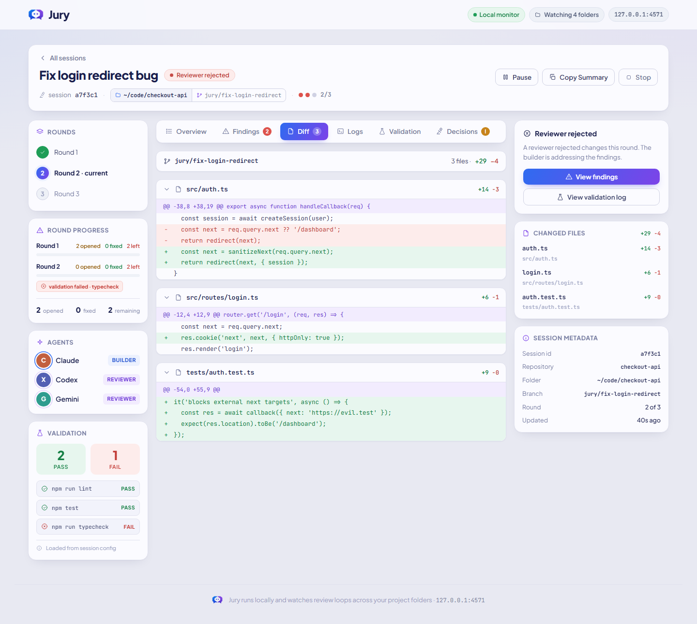
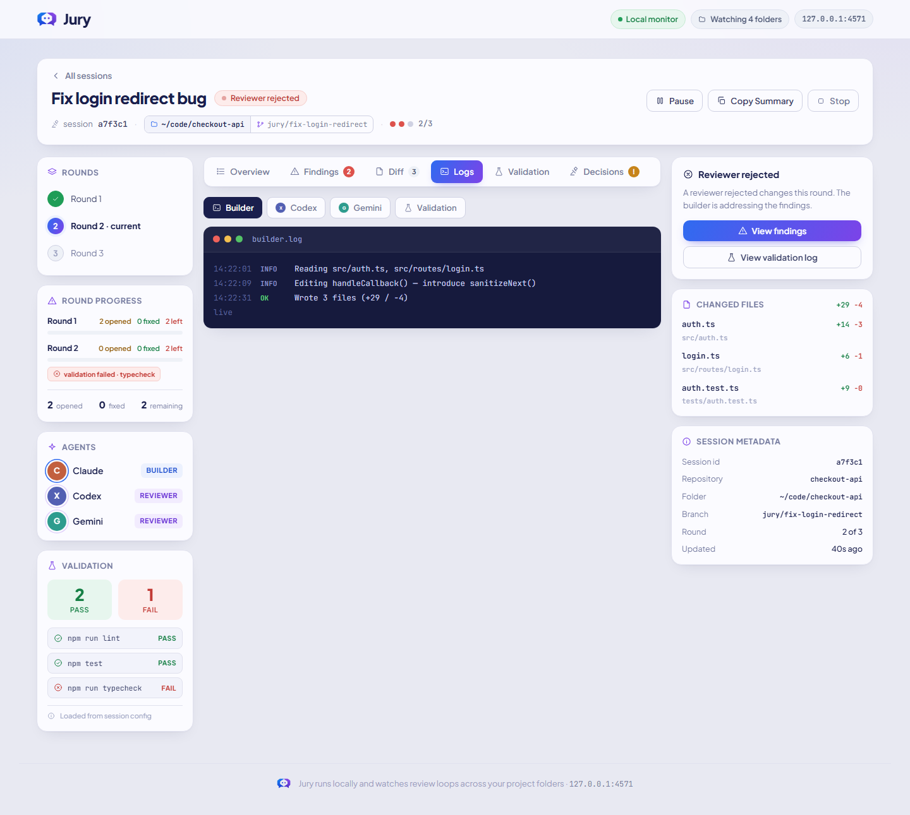
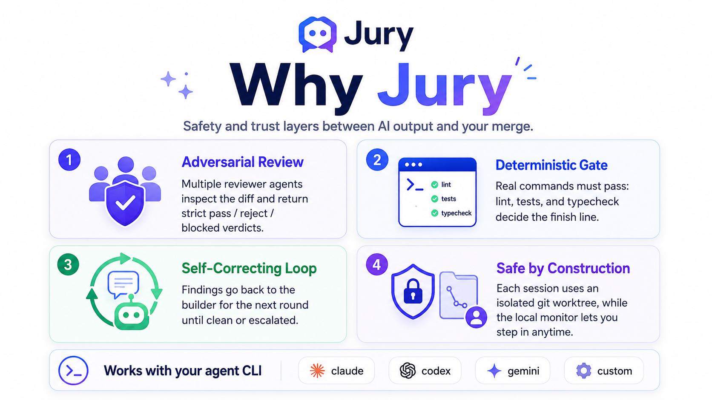
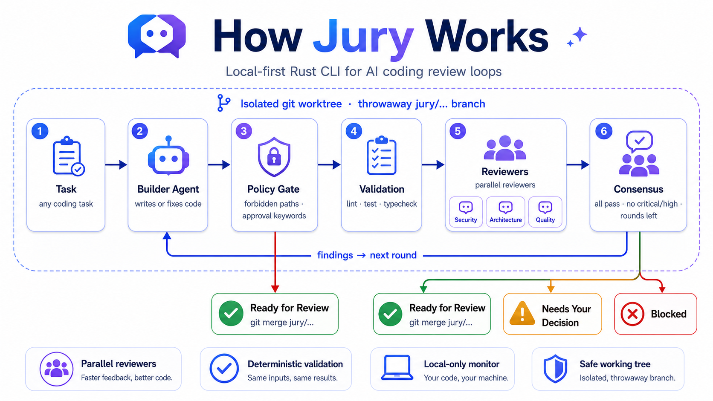
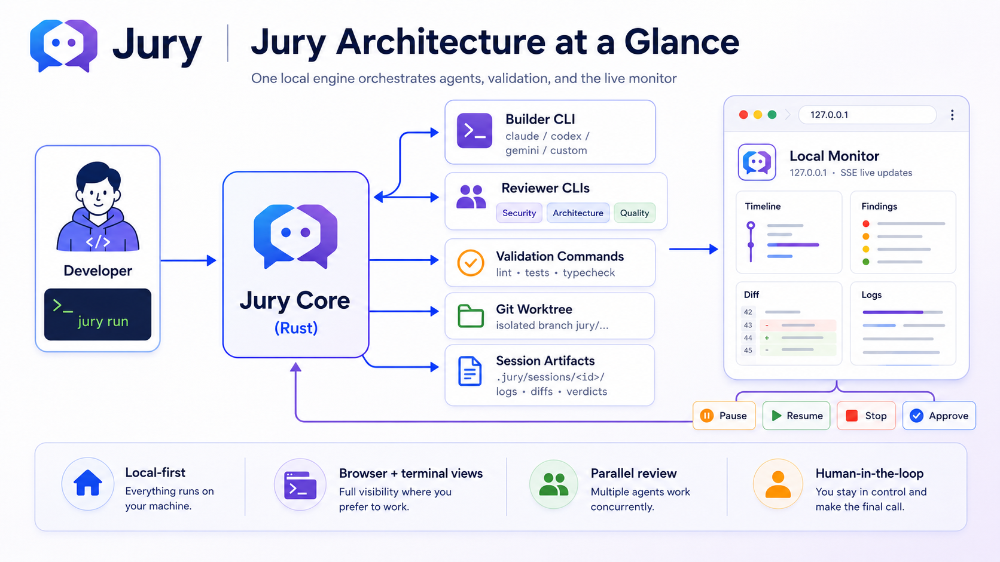

<div align="center">


# Jury

### AI agents that review each other before you trust the result.

**Jury** runs a **builder → reviewers → validation** loop over your codebase: one
AI agent writes the change, others review the diff and return strict verdicts, and
your own lint/test/typecheck commands gate the finish line — all on your machine.

[](https://github.com/morfestboy/Jury/actions/workflows/release.yml)
[](LICENSE)
[](https://www.rust-lang.org)
[](#install)
[](#why-jury)

[Install](#install) · [Quick start](#quick-start) · [How it works](#how-it-works) · [Commands](#commands) · [Configuration](#configuration)

<br/>



<sub>The local monitor — every review loop at a glance.</sub>

</div>

---

## A look inside

A friendly CLI and a live local dashboard — two views of the same loop.

<table>
  <tr>
    <td width="50%" valign="top">
      <br/>
      <sub><b>The CLI</b> — one <code>jury run</code> drives the whole loop: session → builder → reviewers, a live monitor URL, then the exact <code>git merge</code> to bring it in.</sub>
    </td>
    <td width="50%" valign="top">
      <br/>
      <sub><b>Session detail</b> — the “story” timeline, findings by severity, validation, decisions.</sub>
    </td>
  </tr>
  <tr>
    <td width="50%" valign="top">
      <br/>
      <sub><b>Diff</b> — <code>diff.patch</code> parsed into per-file, syntax-toned hunks.</sub>
    </td>
    <td width="50%" valign="top">
      <br/>
      <sub><b>Logs</b> — live stdout/stderr per agent and per validation command.</sub>
    </td>
  </tr>
</table>

The monitor updates over SSE as the loop runs — pause / resume / stop / approve right
from the browser. Tasks &amp; logs render correctly in any language (UTF-8 throughout, Thai included).

## Why Jury

You wouldn't merge a teammate's PR without review. Why merge an AI agent's?
Jury puts a panel of agents between "the AI wrote something" and "I trust it":

<div align="center">

</div>

Everything is **local-first**: no cloud, no login, no account — the monitor binds to
`127.0.0.1` and only ever shows sessions *you* created.

## How it works

<div align="center">

</div>

Reviewers run in **parallel**, each with its own role/focus. The **consensus gate** only
passes when validation is green, every reviewer passes, no critical/high findings are open,
and the round limit isn't exceeded — otherwise findings go back to the builder, or it's
handed to you. Watch and steer it all live — pause / stop / approve / continue, and
**add guidance mid-run** — from the **browser monitor**. All state
(logs, diffs, verdicts, per-round artifacts) lives under `.jury/sessions/<id>/`.

## Architecture at a glance

<div align="center">

</div>

## Install

You need `git`, plus at least one agent CLI (`claude` / `codex` / `gemini`, or a custom command).

### Quick install — prebuilt binary, no Rust required

**macOS / Linux**
```bash
curl -fsSL https://raw.githubusercontent.com/morfestboy/Jury/main/install.sh | sh
```

**Windows (PowerShell)**
```powershell
irm https://raw.githubusercontent.com/morfestboy/Jury/main/install.ps1 | iex
```

The script detects your OS/CPU, downloads the matching binary from the latest
[release](https://github.com/morfestboy/Jury/releases), verifies its checksum, and
installs it. Override with `JURY_REPO` / `JURY_BIN_DIR`.


## Updating

Straight from the CLI:

```bash
jury upgrade
```

It fetches the latest release for your platform and replaces the binary in place
(no `sudo`; installs to the same place the install script used). Re-running the
original `curl … | sh` / `irm … | iex` one-liner does the same. Your `jury.yml` and `.jury/`
session data survive upgrades untouched.

## Uninstall

```bash
jury uninstall
```

Removes the installed `jury` binary (asks first). Your projects' `jury.yml` and
`.jury/` data are left alone — delete those per-project if you want them gone.
Installed from source? `cd Jury && make uninstall`.

## Quick start

```bash
cd your-project        # a git repo with at least one commit
jury init              # detect agents, write jury.yml
jury doctor            # validate the setup
jury run "fix the login redirect bug"
jury open              # open the live browser monitor
```

> 💡 Tasks can be written in any language — Thai included. Jury is UTF-8 safe end to end.

In a terminal, `jury run` opens a **tmux-style split view** — the builder gets its
own pane and each reviewer gets one beside it, all tailing their live output so you
can see who's doing what. Press **`q`** to detach (the session keeps running its
state to disk — resume any time), **`s`** to stop, **`p`** to pause/resume.

While `jury run` is going, the **monitor also starts automatically** at the printed
URL — watch the builder and reviewers live and **pause / stop / approve / continue
another round** from the browser (the CLI stays attached and reacts to your clicks; on
*continue* it runs another round, on *approve* it prints the merge command).
**Pause and stop are immediate** — the in-flight builder/reviewer process is killed,
not left to finish. To send only *some* findings back to the builder, **Accept**
the ones you don't want fixed in the Findings tab, then **Continue** — no checkboxes
needed. All state is saved to disk, so you can always come back:

```bash
jury list            # see every session and where it got to
jury resume          # pick a session from an arrow-key menu and continue it
jury resume <id>     # …or resume a specific one directly
jury upgrade         # (optional) grab the latest first
```

> `jury resume` with no id shows an interactive picker (↑/↓ + Enter) of the
> resumable sessions in this folder — no need to copy an id. It opens the same
> split-screen view as `jury run`.

`jury init` adds `.jury/` to your `.gitignore`, so session state never clutters your
repo. By default each session works on a throwaway `jury/…` branch inside its own git
worktree (your working tree is never touched); `jury stop` / `jury clean` remove the
branch and worktree when you're done. If you'd rather **not** spin up a branch, answer
no to *"Isolate sessions in a git worktree + branch?"* during `jury init` (or set
`workspace.mode: in_place` in `jury.yml`) — sessions then edit your current branch
directly, and `stop` / `clean` leave your repo untouched.

## Commands

| Command | What it does |
| --- | --- |
| `jury init` | Detect agents, suggest validation commands, write `jury.yml` (interactive). |
| `jury doctor` | Pre-flight checks: git repo, writability, agents, validation, monitor port, worktree. |
| `jury run "task"` | Run the loop. Flags: `--builder`, `--reviewer` (repeatable), `--model`, `--max-rounds`, `--skip-validation`. Omit the task for interactive mode. |
| `jury list` | List all sessions. |
| `jury status` | Project + session summary. |
| `jury open` | Start the local browser monitor and open it. |
| `jury attach <id>` | Stream a session's live logs. |
| `jury logs [id]` | Print a round's builder/reviewer/validation logs after the fact (`--round N`; omit the id for the most recent session). Each log ends with `[exit · duration · bytes]` so it's obvious what the agent did. |
| `jury resume [id]` | Continue an interrupted session. **Omit the id** to pick from an arrow-key menu of resumable sessions. Opens the split-screen view. |
| `jury stop <id>` | Stop a session and discard its worktree. |
| `jury clean` | Remove finished sessions' worktrees (`--all` wipes all data). |
| `jury upgrade` | Update Jury to the latest release. |
| `jury uninstall` | Remove the installed binary (project data untouched). |

## Configuration

`jury init` writes a `jury.yml` at your project root.

<details>
<summary><b>Example <code>jury.yml</code></b></summary>

```yaml
project:
  name: my-project

agents:
  builder:
    id: claude
    label: Claude Code
    command: claude
    args: ["-p", "{prompt}"]      # {prompt}/{prompt_file} placeholders; otherwise sent on stdin
    role: builder
    model: sonnet                 # optional → Jury passes `--model sonnet` (pick per agent)
  reviewers:
    - { id: codex,  label: Codex CLI,  command: codex,  role: strict_code_reviewer }
    - { id: gemini, label: Gemini CLI, command: gemini, role: security_reviewer }
    - { id: claude, label: Claude Code, command: claude, role: ui_reviewer }

validation:
  commands:                       # deterministic gates (exit 0 = pass)
    - { name: lint, command: npm, args: ["run", "lint"] }
    - { name: test, command: npm, args: ["test"] }
  expect_files:                   # must exist (and be non-empty) after the build
    - dist/index.html
  criteria:                       # plain-language "done" conditions reviewers must confirm
    - "the login page actually works and redirects correctly"
    - "no button or control is dead / unclickable"

limits: { max_rounds: 3, max_parallel_sessions: 4 }
workspace: { mode: git_worktree, base_dir: .jury/worktrees }
browser: { enabled: true, host: 127.0.0.1, port: 8787 }

policy:
  forbidden_paths: [".env", ".env.*", "secrets/", "private/"]
  require_manual_approval_keywords: ["deploy", "migration", "rm -rf"]
```
</details>

**Agents are pluggable.** Any CLI works — including a shell script. Reviewers must
print JSON matching the schema in the documented JSON schema; Jury tolerates
surrounding prose / code fences and retries once before escalating.

### Roles, validation & "who does the thinking"

- **Every reviewer first applies a baseline check** (regardless of focus): it
  rejects fake/mock/stub work, silent fallbacks, swallowed errors, work *claimed*
  done but not implemented, dead/no-op code, and missing scope. This is generic —
  it helps any project without tuning.
- **`role` picks each reviewer's extra focus** (a **free-text** field — no fixed
  enum). Common names have **built-in presets** so they "just work":
  `strict_code_reviewer`, `security_reviewer`, `ui_reviewer` (dead buttons,
  can't-click, visuals), `ux_reviewer`, `architecture_reviewer`,
  `performance_reviewer`, `test_reviewer`. `jury init` lets you pick a focus per
  reviewer (defaulting to code / UI / security across three reviewers).
  **Want your own?** Put any text in `role:` — even a full instruction, e.g.
  `role: "check that all Thai copy reads naturally and dates are Buddhist-era"`.
  Non-preset roles are injected verbatim. (For the builder, `role` is just a label.)
- **Three ways to gate completion**, mix freely under `validation:`:
  - **`commands`** — deterministic, exit `0`/non-zero. Anything: lint/test, a
    script that checks an image, hits an endpoint, diffs a snapshot…
  - **`expect_files`** — files that must exist and be non-empty after the build.
    For tasks where "done" means a file was produced, not a command that passes.
  - **`criteria`** — plain-language "done" conditions for things no command can
    check; injected into the reviewers' prompt as must-pass requirements.
  Jury runs what you configure; it does **not** invent validation from the task.
- **Jury has no LLM of its own.** It's a deterministic orchestrator (git worktrees,
  process spawning, JSON parsing, consensus rules). All *interpretation* of the task
  is delegated to the agents you configure: the **builder** LLM writes the code and
  the **reviewer** LLMs judge it. If something needs understanding/judgment, that's
  the agents' job — Jury never calls a model behind your back.

## Tech

Rust · [`clap`](https://docs.rs/clap) · [`tokio`](https://tokio.rs) ·
[`axum`](https://github.com/tokio-rs/axum) · [`serde`](https://serde.rs) ·
git worktrees · server-sent events. Frontend is plain React over CDN — no build step.

## License

[MIT](LICENSE) © Jury contributors

<div align="center"><sub>Built to be run locally. Your code never leaves your machine.</sub></div>
